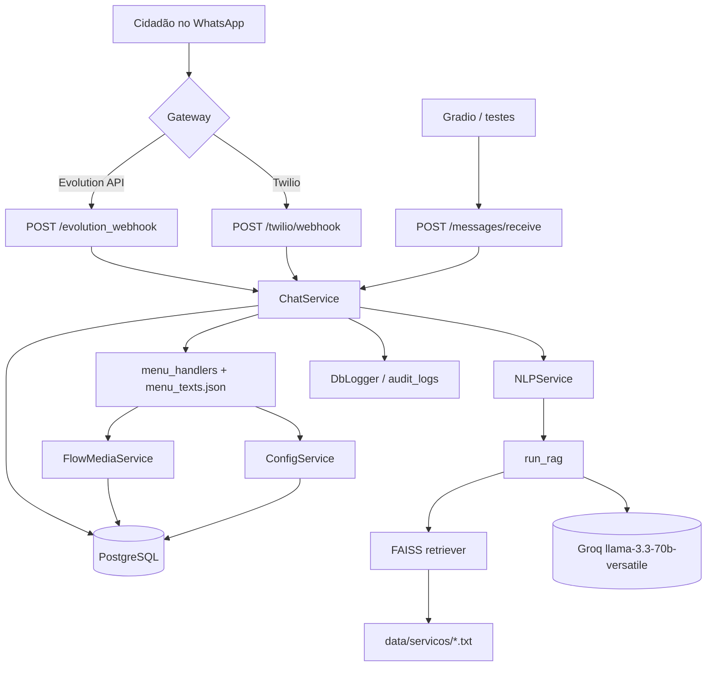

# 02 — Arquitetura

## Visão de componentes



## Duas aplicações no mesmo processo

O projeto tem dois pacotes Python que rodam juntos:

| Pacote | Responsabilidade | Depende de |
|---|---|---|
| `app/` | Núcleo RAG puro. Não conhece HTTP, banco nem WhatsApp. | LangChain, FAISS, HuggingFace, Groq |
| `api/` | Backend FastAPI. Estado da conversa, menus, persistência, webhooks. | FastAPI, SQLAlchemy, Alembic, `app/` |

`api/main.py` amarra os dois:

```python
pln_resources = setup_system()                       # app/ constrói o índice FAISS
app.state.nlp_service = NLPService(retriever=pln_resources["servicos"])
```

O índice é construído **uma vez, na subida do processo**, e fica em memória
(`app.state`). Não há persistência do índice em disco.

## Camadas do `api/`

```
security.py   Autenticação das rotas de entrada. Sem import de app/ nem services.
routes/       Adaptadores HTTP (Evolution, Twilio, REST). Sem regra de negócio.
services/     Regra de negócio:
                chat_service.py     máquina de estados + orquestração
                menu_handlers.py    navegação do menu dinâmico (JSON)
                nlp_service.py      ponte para o RAG do app/
                config_service.py   leitura/escrita de system_configs
                flow_media_service.py  resolução de URL de imagem
schemas/      Pydantic: MessageSchema (entrada), MessageOut / ChatResponse (saída)
models/       SQLAlchemy: User, Chat, Message, SystemConfig, FlowMedia, AuditLog
db/           Engine, SessionLocal, get_db
dependencies/ get_session (idêntico a get_db — duplicação)
utils/        DbLogger (log em console + tabela audit_logs)
alembic/      Migrações
```

## Camadas do `app/`

```
core/ingestion.py    DirectoryLoader sobre data/servicos/*.txt
adapters/splitter.py RecursiveCharacterTextSplitter (1000/200)
adapters/embeddings.py  HuggingFaceEmbeddings all-MiniLM-L6-v2
adapters/vector_store.py FAISS.from_documents + as_retriever(k=10)
adapters/prompts.py  intent_prompt, greeting_prompt, rag_prompt
core/rag_pipeline.py get_llm (cache global), classify_input, run_rag
core/conversation.py generate_response — usada apenas pelo Gradio
main.py              setup_system() → {"servicos": retriever}
```

## Ciclo de vida de uma mensagem

1. Gateway entrega a mensagem no webhook correspondente.
2. A rota autentica a requisição via `api/security.py` — assinatura Twilio ou segredo
   compartilhado. Falhou, responde 403 e nada mais acontece.
3. A rota extrai `id_wpp` e `text` e instancia `ChatService(db, nlp_service)`.
4. `ChatService.process_message`:
   1. normaliza o texto (`_clean_text`);
   2. busca/cria `User` e `Chat`;
   3. grava log em `audit_logs` (`MESSAGE_RECEIVED`);
   4. persiste a mensagem do usuário;
   5. decide a resposta pela máquina de estados (ver [doc 05](05-fluxo-conversa.md));
   6. persiste a resposta do bot e faz `commit`.
5. A rota converte `ChatResponse` no formato do gateway:
   - Evolution: chama `send_image` ou `send_text` via HTTP;
   - Twilio: devolve TwiML XML com `<Body>` e opcional `<Media>`;
   - REST: devolve JSON `MessageOut`.

Erros dentro de `process_message` fazem `rollback` e devolvem
`"Desculpe, ocorreu um erro interno."` — a conversa nunca quebra para o usuário.

## Decisões de projeto relevantes

- **Índice em memória, reconstruído a cada boot.** Simples, mas o startup paga o custo
  de baixar o modelo de embeddings e vetorizar ~16 arquivos. Aceitável nesse volume.
- **LLM em cache global** (`CACHED_LLM` em `rag_pipeline.py`): evita recriar o cliente
  Groq a cada requisição.
- **Menu como dado, não como código**: `menu_texts.json` descreve estados, textos,
  próximos estados e queries de RAG. Adicionar um menu não exige mudar Python.
- **Resolução de imagem em cascata**: `flow_media` (BD) → `system_configs` (BD) →
  variável de ambiente → fallback no JSON.
