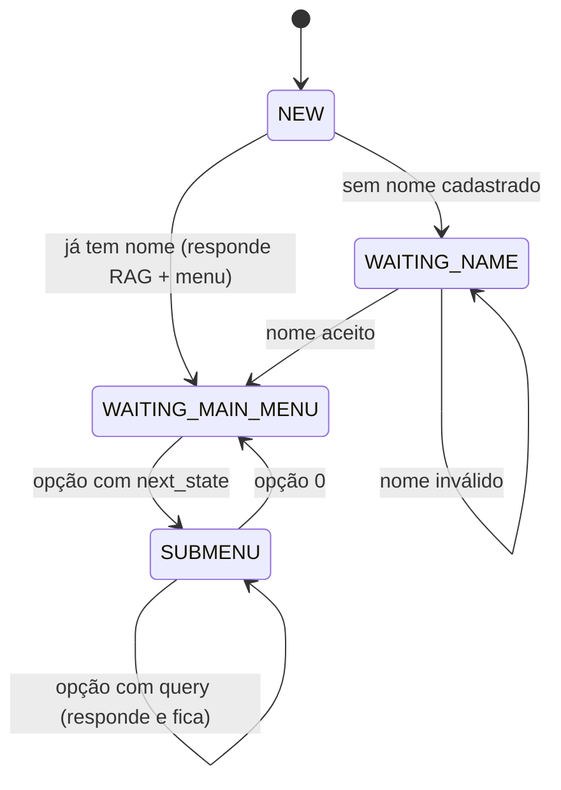

# 05 — Fluxo de Conversa

Implementado em `api/services/chat_service.py` (decisão) e
`api/services/menu_handlers.py` + `api/services/menu_texts.json` (navegação).

## Estado do usuário

O campo `users.state` guarda o nó atual. Estados especiais:

| Estado | Significado |
|---|---|
| `NEW` | Usuário recém-criado ou conversa resetada |
| `WAITING_NAME` | Aguardando o primeiro nome |
| `WAITING_MAIN_MENU` | Menu principal (também é chave em `menu_texts.json`) |
| `WAITING_<n>_<...>` | Qualquer submenu definido no JSON |

Qualquer estado que **não** seja `NEW`/`WAITING_NAME` e que não exista em
`menu_texts.json` é normalizado para `WAITING_MAIN_MENU` na entrada da mensagem.
Isso torna a conversa resiliente a estados órfãos após mudança do JSON.

## Onboarding



### Validação de nome (`WAITING_NAME`)

| Regra | Mensagem de erro |
|---|---|
| `len(nome) < 2` | "Digite um nome válido." |
| `len(nome) > 30` | "Nome muito longo. Digite apenas seu primeiro nome." |
| contém dígito | "O nome não deve conter números." |
| mais de 3 palavras | "Digite apenas seu primeiro nome." |

Aceito → grava `users.name`, vai para `WAITING_MAIN_MENU` e já exibe o menu.

## Comandos globais

| Comando | Efeito |
|---|---|
| `menu` ou `/menu` | Volta ao menu principal. Se o usuário ainda não tem nome, cai em `WAITING_NAME` |
| `/resetar` | `state = NEW` e responde "Conversa reiniciada!". **Não apaga o nome nem o histórico** |
| `0` | Dentro de um submenu, volta ao nível anterior (definido no JSON) |

## Normalização do texto (`_clean_text`)

```python
if ":" in text:
    text = text.split(":")[-1]     # descarta prefixo antes do último ":"
return " ".join(text.strip().split())  # colapsa espaços
```

O corte no `:` existe porque alguns gateways prefixam a mensagem
(ex.: `whatsapp:oi`). Efeito colateral: qualquer mensagem legítima com `:` perde a
parte anterior (`"Horário: 8 às 17"` vira `"8 às 17"`).

## Tratamento de uma mensagem em estado de menu

Estando o usuário num estado presente em `menu_texts.json`:

1. **A entrada é uma opção válida do menu?** → `handle_dynamic_menu` navega
   (ver seção seguinte).
2. **A entrada é um número, mas não é opção válida?** → "Opção inválida" + reexibe o menu.
3. **A entrada é texto livre?**
   - Se `maintenance_mode == "true"` em `system_configs` → "O Chat Bot está em manutenção."
   - Senão → manda para o RAG. Se a resposta contiver alguma das palavras de falha
     (`desculpe`, `sinto muito`, `não encontrei`, `não entendi`, `inválido`) ou vier
     vazia, trata como fracasso e reexibe o menu. Caso contrário, devolve
     `resposta + menu atual`.

Essa heurística de detecção de falha por substring é frágil: uma resposta correta que
contenha "desculpe" é descartada. Ver [doc 10](10-problemas-conhecidos.md).

## Menu dinâmico (`menu_texts.json`)

Estrutura de cada estado:

```json
"WAITING_1_AGENDAMENTO": {
  "text": "📅 *1- MENU AGENDAMENTO*\n\n1️⃣ - ...\n0️⃣ - Voltar ao menu principal",
  "options": {
    "1": { "next_state": "WAITING_1_1_INFO" },
    "0": { "next_state": "WAITING_MAIN_MENU" }
  }
}
```

Cada opção tem **um** de dois comportamentos:

| Chave | Comportamento |
|---|---|
| `next_state` | Muda `users.state` e exibe o texto do novo estado |
| `query` | Envia a pergunta pré-definida ao RAG e mantém o estado atual |

Chave opcional em qualquer opção:

| Chave | Efeito |
|---|---|
| `image_key` | Resolve uma URL de imagem e a anexa à resposta (ver [doc 09](09-configuracao-e-midias.md)) |

Respostas de `query` recebem o rodapé:
`*(Escolha outra opção do menu ou digite 0 para voltar ao início)*`

## Mapa de menus

```
WAITING_MAIN_MENU
├── 1 WAITING_1_AGENDAMENTO
│   ├── 1 WAITING_1_1_INFO          (6 queries: onde agendar, USF/UBS, CRPEE, documentos, oncológicos)
│   ├── 2 WAITING_1_2_CONSULTAS     (9 queries: clínico, enfermagem, odonto, fisio, psico, nutri, ed. física, farmacêutico, domiciliar)
│   └── 3 WAITING_1_3_EXAMES        (laboratório, imagem)
├── 2 WAITING_2_MATERIAIS
│   ├── 1-5 queries diretas          (farmácias UBS/Família/Popular, fitas e lancetas, fraldas)
│   ├── 6 WAITING_2_6_AUDITIVOS
│   ├── 7 WAITING_2_7_LOCOMOCAO
│   ├── 8 WAITING_2_8_PROTESES
│   └── 9 WAITING_2_9_OSTOMIA
├── 3 WAITING_3_PROCEDIMENTOS       (calendário vacinal [image_key CALENDARIO], curativos, aferição PA/glicemia)
├── 4 WAITING_4_SERVICOS
│   ├── 1  query Facilita Saúde
│   ├── 2  WAITING_4_2_CEMERF
│   ├── 3  WAITING_4_3_CEMAE
│   ├── 4  WAITING_4_4_CEO
│   ├── 5  WAITING_4_5_CAPS2
│   ├── 6  WAITING_4_6_CAPS_AS_III
│   ├── 7  WAITING_4_7_AMB_MENTAL
│   ├── 8  WAITING_4_8_SEC_SAUDE
│   ├── 9  WAITING_4_9_OXIGENOTERAPIA
│   ├── 10 WAITING_4_10_ELETROCARDIOGRAMA
│   ├── 11 WAITING_4_11_ESPIROMETRIA
│   ├── 12 WAITING_4_12_ASMA_GRAVE
│   └── 13-16 queries diretas        (CRAS/CREAS, Conselho do Idoso, Convivência ao Idoso, Delegacias)
├── 5 WAITING_5_EMERGENCIAS         (7 queries: picadas, AVC, engasgo, quedas, sangramento, surtos, violência)
└── 6 WAITING_6_OUTROS              (pergunta livre → RAG)
```

Os submenus de serviço (CEMERF, CEMAE, CEO, CAPS…) seguem sempre o mesmo padrão de
6 a 8 perguntas: *o que é / como acessar / documentos / onde fica / horários / contatos*
(e, na saúde mental, *acolhimento* e *atendimentos*).

## Persistência

Toda mensagem — do usuário e do bot — vira uma linha em `messages`, vinculada ao
`Chat` do usuário. `_get_or_create_chat` reutiliza sempre o **primeiro** chat do
usuário: na prática existe um único chat por pessoa, e todo o histórico fica nele.

## Como adicionar um menu

1. Edite `api/services/menu_texts.json`: novo estado com `text` e `options`.
2. Aponte alguma opção existente para ele via `next_state`.
3. Inclua `"0": { "next_state": "<estado pai>" }` para permitir voltar.
4. Se a opção responder por RAG, use `query` com uma pergunta que exista na base
   (`data/servicos/`).
5. Reinicie a aplicação — o JSON é lido uma única vez, no import do módulo.
