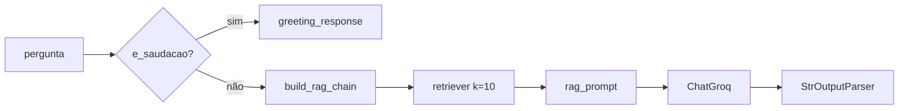

# 06 — Pipeline RAG

Todo o núcleo de IA vive em `app/`. Não conhece HTTP, banco nem WhatsApp.

## Montagem (uma vez por processo)

`app/main.py`:

```python
def setup_system():
    docs_servicos   = load_servicos()                          # 1. carregar
    chunks_servicos = split_docs(docs_servicos)                # 2. fatiar
    embeddings      = get_embeddings()                          # 3. vetorizar
    vector_store    = create_vector_store(chunks_servicos, embeddings)  # 4. indexar
    retriever       = create_retriever(vector_store)            # 5. expor busca
    return {"servicos": retriever}
```

Chamado em `api/main.py` na subida e guardado em `app.state.nlp_service`.

### 1. Ingestão — `app/core/ingestion.py`

```python
DirectoryLoader(<raiz>/data/servicos, glob="*.txt",
                loader_cls=TextLoader, loader_kwargs={"encoding": "utf-8"})
```

Caminho resolvido a partir de `__file__`, então independe do diretório de execução.
Levanta `FileNotFoundError` se a pasta não existir. `glob="*.txt"` é raso — arquivos
em subpastas de `data/servicos/` são ignorados.

### 2. Chunking — `app/adapters/splitter.py`

`RecursiveCharacterTextSplitter`:

| Parâmetro | Valor |
|---|---|
| `separators` | `["\n\n", "\n", ". ", " ", ""]` |
| `chunk_size` | 1000 |
| `chunk_overlap` | 200 |
| `length_function` | `len` (caracteres) |

Como os arquivos têm ~1 KB a 3 KB, a maioria vira 1–3 chunks. Documentos curtos
tendem a sobreviver inteiros — bom para respostas de endereço/horário.

### 3. Embeddings — `app/adapters/embeddings.py`

Padrão: `sentence-transformers/paraphrase-multilingual-MiniLM-L12-v2`, sobrescrevível
pela variável `EMBEDDINGS_MODEL`.

Modelo de 384 dimensões, roda em CPU, baixado do Hub no primeiro uso e cacheado em
`~/.cache/huggingface`. Substituiu `all-MiniLM-L6-v2`, que é treinado majoritariamente em
inglês enquanto a base inteira está em português. É o equivalente multilíngue da mesma
família e não exige prefixo de `query:`/`passage:` como os modelos E5 — a troca é só o
nome do modelo, sem mudança no pipeline.

> A melhora não foi medida. Só dá para comprovar rodando o RAG com o modelo baixado e
> comparando respostas antes/depois num conjunto de perguntas reais. Se a recuperação
> piorar, `EMBEDDINGS_MODEL=sentence-transformers/all-MiniLM-L6-v2` volta ao anterior sem
> alterar código.

### 4. Vector store — `app/adapters/vector_store.py`

```python
FAISS.from_documents(docs, embeddings)
vector_store.as_retriever(search_kwargs={"k": 10})
```

Índice **em memória**, sem `save_local`/`load_local`. Reconstruído a cada boot.
`k=10` é generoso para uma base de 16 arquivos: quase toda a base entra no contexto,
o que reduz o risco de não recuperar o trecho certo mas aumenta o de o LLM misturar
serviços — daí a instrução explícita no prompt para identificar o serviço correto.

## Execução de uma pergunta

`app/core/rag_pipeline.py`:



### `get_llm()`

| Parâmetro | Valor |
|---|---|
| modelo | `llama-3.3-70b-versatile` (Groq) |
| `temperature` | 0.1 |
| `max_tokens` | 500 |
| cache | variável global `CACHED_LLM` |

Sem `GROQ_API_KEY` no ambiente, levanta `ValueError`.

### `e_saudacao(texto)` — `app/core/intencao.py`

Detecção local, sem LLM: normaliza (minúsculas, sem acento, sem pontuação nas bordas) e
compara com um conjunto de saudações. Mensagem com mais de 3 palavras nunca é saudação,
então `"Oi, onde fica o CEMERF?"` vai para o RAG.

Substituiu `classify_input`, que gastava **uma chamada de LLM em toda mensagem de texto
livre** só para decidir entre `greeting` e `question` — dobrando latência e custo para
reconhecer "oi".

Falso negativo é barato: uma saudação fora da lista vira pergunta, o RAG não acha nada e o
menu é reexibido. Falso positivo seria caro — engoliria a pergunta do cidadão — e é o que
o limite de palavras evita.

### `run_rag(retriever, question)`

1. Pergunta vazia → `"Digite uma pergunta válida."`
2. `e_saudacao` → resposta de saudação gerada pelo `greeting_prompt`.
3. Caso contrário → cadeia RAG:
   `{context: retriever, question: passthrough} | rag_prompt | llm | StrOutputParser()`

`build_rag_chain` é reconstruída a cada chamada (barato — é só composição de
runnables; o LLM vem do cache).

## Prompts — `app/adapters/prompts.py`

| Prompt | Papel |
|---|---|
| `greeting_prompt` | Few-shot de um exemplo; gera a saudação institucional padrão |
| `rag_prompt` | Prompt principal do RAG |

Regras impostas pelo `rag_prompt`:

1. Usar **apenas** o contexto fornecido.
2. O contexto mistura vários serviços — identificar o serviço perguntado e usar só o
   trecho correspondente.
3. Não inventar links, formulários ou passos.
4. Sem resposta no contexto → responder **exatamente**
   `"Desculpe, não encontrei essa informação específica nos meus documentos."`

A frase de fallback do item 4 é o gancho da heurística de falha em
`ChatService` (detecta "desculpe" / "não encontrei").

## Ponte com o backend — `api/services/nlp_service.py`

```python
class NLPService:
    def __init__(self, retriever): ...
    def process(self, text, user_name=None) -> Optional[str]
```

**Devolve `None` quando o RAG não achou resposta** — texto vazio ou a frase de fallback.
Isso poupa o chamador de adivinhar a falha procurando palavras dentro da resposta, que era
o comportamento anterior e descartava resposta boa por conter "desculpe".

A detecção mora em `app/adapters/respostas.py`:

```python
RESPOSTA_SEM_CONTEXTO = "Desculpe, não encontrei essa informação específica nos meus documentos."
NUCLEO_SEM_CONTEXTO   = "não encontrei essa informação"

def sem_contexto(resposta: str) -> bool
```

O módulo não importa nada — de propósito. Quem precisa saber "o RAG falhou?" não deveria
carregar LangChain para descobrir, e é isso que permite testar a máquina de estados no CI.
`rag_prompt` interpola `RESPOSTA_SEM_CONTEXTO`, então a frase que o modelo é instruído a
emitir e a frase que o código reconhece são literalmente a mesma.

O casamento é pelo núcleo, não por igualdade exata: o modelo às vezes devolve a frase com
aspas, ponto final a mais ou quebra de linha.

Com resposta válida, personaliza a saudação:

| Condição na resposta | Substituição |
|---|---|
| contém a saudação institucional completa | `"Oi, {nome}! 😊\nComo posso te ajudar?"` |
| contém `"Olá!"` | troca `"Olá!"` por `"Oi, {nome}! 😊"` |

## Caminho alternativo: Gradio

`app/core/conversation.py` → `generate_response(mensagem, historico, retrievers_dict)`
é usada **apenas** por `frontend/gradio_app.py`. Ignora `historico` (não há memória de
conversa em nenhum caminho do sistema) e chama `run_rag` direto.

## Testes

`app/test/` foi removido: eram três scripts de inspeção manual (só `print`, sem assert),
um deles quebrado havia tempo por importar um módulo inexistente. Os testes reais vivem
em `tests/` — ver [doc 11](11-ci.md).

Do pipeline RAG, o que roda no CI é o que não precisa de LangChain: `e_saudacao` e
`sem_contexto`. Recuperação e qualidade de resposta continuam sem cobertura automatizada,
porque exigiriam baixar o modelo e ter chave da Groq.
