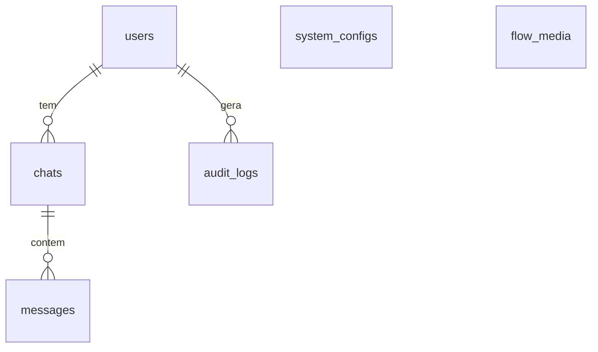

# 07 — Banco de Dados

PostgreSQL, acessado via SQLAlchemy ORM. Migrações com Alembic.
Modelos em `api/models/models.py`.

## Diagrama



`system_configs` e `flow_media` não têm relacionamento — são tabelas de configuração.

## Tabelas

### `users`

| Coluna | Tipo | Notas |
|---|---|---|
| `id` | Integer PK autoincrement | |
| `id_wpp` | String, **unique**, not null | Identificador do WhatsApp |
| `name` | String, nullable | Primeiro nome informado pelo usuário |
| `state` | String, default `"NEW"` | Estado atual no menu |
| `created_at` | DateTime | |

`cascade="all, delete-orphan"` em `chats`: apagar o usuário apaga seus chats.

### `chats`

| Coluna | Tipo | Notas |
|---|---|---|
| `id` | Integer PK | |
| `user_id` | Integer FK → `users.id`, not null | |
| `created_at` | DateTime | |

Na prática há **um chat por usuário**: `_get_or_create_chat` sempre pega o primeiro.

### `messages`

| Coluna | Tipo | Notas |
|---|---|---|
| `id` | Integer PK | |
| `chat_id` | Integer FK → `chats.id`, not null | |
| `text` | String, not null | Conteúdo |
| `sender` | String, not null | `"user"` ou `"bot"` |
| `created_at` | DateTime | |

Guarda conteúdo enviado por cidadãos sobre saúde — dado sensível.
Ver [doc 10](10-problemas-conhecidos.md).

### `system_configs`

Chave-valor de configuração em runtime.

| Coluna | Tipo | Notas |
|---|---|---|
| `key` | String PK, indexada | ex.: `maintenance_mode`, `flow_image.calendario` |
| `value` | String, not null | Sempre string; `"true"`/`"false"` para flags |
| `description` | String, nullable | |
| `is_active` | Boolean, default `True` | Registros inativos são ignorados na leitura |
| `updated_at` | DateTime, `onupdate` | |

### `flow_media`

Mídias associadas a opções de menu.

| Coluna | Tipo | Notas |
|---|---|---|
| `id` | Integer PK | |
| `flow_key` | String, not null, indexada | Comparado em **maiúsculas** (`CALENDARIO`) |
| `media_type` | String, default `"image"` | Só `"image"` é consultado hoje |
| `media_url` | Text, not null | |
| `caption` | Text, nullable | Coluna existe, mas não é usada no envio |
| `is_active` | Boolean, default `True` | |
| `updated_at` | DateTime, `onupdate` | Usada para ordenar (mais recente vence) |

### `audit_logs`

| Coluna | Tipo | Notas |
|---|---|---|
| `id` | Integer PK | |
| `user_id` | Integer FK → `users.id`, nullable | |
| `level` | String, not null | `INFO`, `ERROR` |
| `event_type` | String, not null | ex.: `MESSAGE_RECEIVED` |
| `message` | Text, not null | |
| `metadata_info` | JSON, nullable | Campo livre |
| `created_at` | DateTime | |

Escrito por `api/utils/logger.py::DbLogger.log_event`, que loga no console e grava
a linha. Falha de gravação não derruba a requisição — captura a exceção, loga e faz
rollback. Hoje só há **um** ponto de chamada (`MESSAGE_RECEIVED` em `ChatService`).

## Conexão

`api/db/database.py`:

```python
DATABASE_URL = os.getenv("DATABASE_URL")
engine = create_engine(DATABASE_URL)
SessionLocal = sessionmaker(bind=engine)

def get_db():
    db = SessionLocal()
    try: yield db
    finally: db.close()
```

`api/dependencies/dependencies.py::get_session` é uma cópia funcionalmente idêntica.
As rotas de webhook usam `get_db`; `/messages/receive` usa `get_session`. Duplicação
sem propósito — consolidar em uma só.

## Migrações

Diretório: `api/alembic/`. Config: `api/alembic.ini` (`script_location = %(here)s/alembic`,
`prepend_sys_path = .`). A URL vem do `.env` via `env.py`, sobrescrevendo o placeholder
do `.ini`. `compare_type=True` está ativo nos dois modos.

### Cadeia de revisões

| Revisão | Descrição | down_revision |
|---|---|---|
| `c017765344ef` | Inicial: `users`, `chats`, `messages` | — |
| `725740865e73` | `system_configs`, `audit_logs` | `c017765344ef` |
| `7f566e777933` | `users.name`, `users.state` | `725740865e73` |
| `f36d189f393f` | Merge heads (no-op) | `('a8f3b1c2d4e5', '7f566e777933')` |

> ⚠️ **`a8f3b1c2d4e5` não existe** em `api/alembic/versions/`. É o ramo que deveria
> criar a tabela `flow_media` — que está no ORM mas em nenhuma migração presente.
> Consequência: `alembic upgrade head` falha com `KeyError`/revisão não encontrada, e,
> num banco criado do zero pelas migrações existentes, `flow_media` não existe.
> `FlowMediaService` já trata isso: captura `ProgrammingError`/`OperationalError`,
> faz rollback e cai para o próximo nível da cascata de resolução de imagem.
> Ver [doc 10](10-problemas-conhecidos.md) para as opções de correção.

### Comandos

```powershell
cd api
alembic current                       # revisão aplicada
alembic history --verbose             # cadeia completa
alembic revision --autogenerate -m "descricao"
alembic upgrade head
alembic downgrade -1
```

Sempre rodar a partir de `api/` — `env.py` faz `from models.models import Base`.
