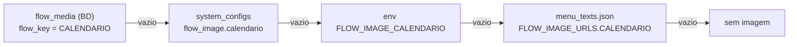

# 09 — Configuração e Mídias

## Configuração em runtime — `system_configs`

`api/services/config_service.py` lê e grava a tabela `system_configs`.
Só registros com `is_active = True` são lidos.

```python
ConfigService(db).get_config("maintenance_mode", "false")
ConfigService(db).set_config("maintenance_mode", "true", "Pausa para manutenção")
```

### Chaves usadas pelo código

| Chave | Valores | Efeito |
|---|---|---|
| `maintenance_mode` | `"true"` / `"false"` (default `"false"`) | Com `"true"`, texto livre não vai ao RAG — o bot responde "O Chat Bot está em manutenção.". **Navegação por números continua funcionando** |
| `flow_image.<chave>` | URL | Segundo nível da cascata de imagens (ver abaixo). A chave é sempre minúscula: `flow_image.calendario` |

Ativar manutenção via SQL:

```sql
INSERT INTO system_configs (key, value, description, is_active)
VALUES ('maintenance_mode', 'true', 'Pausa para manutencao', true)
ON CONFLICT (key) DO UPDATE SET value = 'true', is_active = true;
```

Não existe endpoint administrativo — a alteração é feita direto no banco ou por código.

> Detalhe de implementação: em `set_config`, `updated_at` só é atualizado quando um
> `description` é passado. Atualizações sem descrição deixam o carimbo de tempo velho.

## Imagens de fluxo

Uma opção de menu pode anexar imagem à resposta:

```json
"1": { "query": "Calendário Vacinal do Idoso", "image_key": "CALENDARIO" }
```

Hoje há **uma** imagem configurada: `CALENDARIO`, no menu
`WAITING_3_PROCEDIMENTOS`, opção 1 (calendário vacinal do idoso).

### Cascata de resolução

`api/services/menu_handlers.py::_resolve_image_url` tenta, nesta ordem:



| Nível | Fonte | Chave | Quando usar |
|---|---|---|---|
| 1 | `flow_media` | `flow_key` em **MAIÚSCULAS**, `media_type='image'`, `is_active=true`, mais recente por `updated_at` | Troca frequente, com histórico |
| 2 | `system_configs` | `flow_image.<chave minúscula>` | Ajuste pontual |
| 3 | variável de ambiente | `FLOW_IMAGE_<CHAVE MAIÚSCULA>` | Diferença por ambiente (dev/prod) |
| 4 | `menu_texts.json` | `FLOW_IMAGE_URLS.<chave>` | Fallback versionado no repositório |

Fallback atual no JSON:

```json
"FLOW_IMAGE_URLS": {
  "CALENDARIO": "https://vfnrmghzyxkpdcvlonjt.supabase.co/storage/v1/object/public/flow_image.vacinacao/vacinacao.jpeg"
}
```

Se `flow_media` não existir no banco — ambiente que nunca rodou `alembic upgrade head` —
`FlowMediaService` captura `ProgrammingError`/`OperationalError`, faz rollback e a cascata
segue para o nível 2 sem quebrar a conversa.

### Trocar uma URL de imagem

`flow_media` existe justamente para mudar imagem **sem deploy**. O caminho normal é um
`UPDATE` no banco:

```sql
UPDATE flow_media
   SET media_url = 'https://.../nova.jpeg', updated_at = NOW()
 WHERE flow_key = 'CALENDARIO' AND media_type = 'image';
```

⚠️ Editar só o `menu_texts.json` **não** muda o que o cidadão recebe num banco migrado: o
JSON é o último fallback da cascata, e o `flow_media` vence. Já aconteceu de uma troca de
imagem ficar meses sem efeito em produção por causa disso.

Migração nova só se for para corrigir dados já gravados em ambientes existentes.

### Adicionar uma nova imagem

1. Publique a imagem em uma URL pública acessível pelo gateway do WhatsApp.
2. Adicione `"image_key": "MINHA_CHAVE"` à opção desejada em `menu_texts.json`.
3. Registre a URL em um dos quatro níveis. Mais simples: `FLOW_IMAGE_URLS` no próprio
   JSON. Mais flexível (sem redeploy): `flow_media` ou `system_configs`.

```sql
INSERT INTO flow_media (flow_key, media_type, media_url, is_active, updated_at)
VALUES ('MINHA_CHAVE', 'image', 'https://.../imagem.png', true, NOW());
```

Atenção ao casing: `flow_media.flow_key` é comparado em **maiúsculas**,
`system_configs` usa a chave em **minúsculas** com prefixo `flow_image.`.

### Como a imagem é entregue

| Gateway | Comportamento |
|---|---|
| Evolution API | `POST /message/sendMedia/{instance}` com `mediatype=image`, `caption` = texto da resposta. **Só a imagem é enviada** — o texto vai como legenda |
| Twilio | TwiML com `<Media>` dentro de `<Message>`, junto do `<Body>` |
| REST `/messages/receive` | Campo `image_url` no JSON; a renderização é do cliente |

Na Evolution API o `mimetype` e o `fileName` saem de `mimetypes.guess_type(url)`. Falhando
o envio da imagem, a rota manda o texto puro — o cidadão recebe a resposta mesmo sem a
foto. Ver [doc 04](04-api-referencia.md).

## Configuração fora do banco

| Valor | Local | Observação |
|---|---|---|
| `EVOLUTION_URL`, `EVOLUTION_INSTANCE`, `EVOLUTION_API_KEY` | `.env`, lidas em `api/routes/webhook.py` | Sem default para a chave: em branco falha ao enviar |
| `WEBHOOK_TOKEN`, `TWILIO_AUTH_TOKEN`, `PUBLIC_BASE_URL` | `.env`, lidas em `api/security.py` | Autenticação das rotas de entrada |
| Modelo do LLM, temperatura, `max_tokens` | hardcoded em `app/core/rag_pipeline.py` | |
| Modelo de embeddings | hardcoded em `app/adapters/embeddings.py` | |
| `k` do retriever | default `10` em `create_retriever` | |
| `chunk_size` / `chunk_overlap` | hardcoded em `app/adapters/splitter.py` | |
